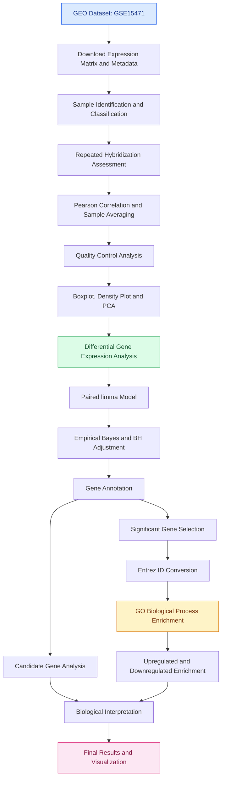

# Pancreatic Cancer Transcriptomics – Workflow

```mermaid
flowchart TD
    A["GEO Dataset: GSE15471"] --> B["Download Expression Matrix and Metadata"]
    B --> C["Sample Identification and Classification"]
    C --> D["Repeated Hybridization Assessment"]
    D --> E["Pearson Correlation and Sample Averaging"]
    E --> F["Quality Control Analysis"]
    F --> G["Boxplot, Density Plot and PCA"]
    G --> H["Differential Gene Expression Analysis"]
    H --> I["Paired limma Model"]
    I --> J["Empirical Bayes and BH Adjustment"]
    J --> K["Gene Annotation"]
    K --> L["Candidate Gene Analysis"]
    K --> M["Significant Gene Selection"]
    M --> N["Entrez ID Conversion"]
    N --> O["GO Biological Process Enrichment"]
    O --> P["Upregulated and Downregulated Enrichment"]
    L --> Q["Biological Interpretation"]
    P --> Q
    Q --> R["Final Results and Visualization"]

    style A fill:#dbeafe,stroke:#2563eb,color:#1e3a8a
    style H fill:#dcfce7,stroke:#16a34a,color:#14532d
    style O fill:#fef3c7,stroke:#d97706,color:#78350f
    style R fill:#fce7f3,stroke:#db2777,color:#831843
```
